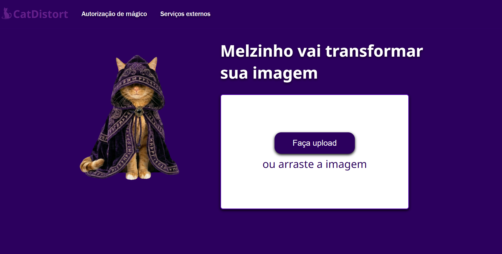

🐱 CatDistort

CatDistort é uma aplicação web divertida que permite fazer upload de imagens e piorar as imagens com o intuito de criar memes.

📸 Preview

🚀 Sobre o projeto

Este projeto foi desenvolvido como prática de:

-Manipulação de imagens com JavaScript
-Uso do Canvas (HTML5)
-Upload de arquivos
-Interação com o usuário
-Organização de projeto front-end

A ideia é a criação de memes em conjunto a interação do usuario com a interface.

🚀 Como executar o projeto

1. Abra o arquivo `index.html` diretamente no navegador ou clique duas vezes no arquivo.

📌 Funcionalidades

-Upload de imagens
-Drag and drop (arrastar e soltar)
-Dowload de imagem editada
-Interface temática

🛠️ Tecnologias usadas

-HTML5
-CSS3
-JavaScript (Vanilla)
-Canvas API

📂 Estrutura do projeto
CatDistort/

assets/
    arquivos/
    imagens/
    sons/
css/
    style.css
js/
    app.js

.gitignore
index.html
LICENSE
REAFME.md

📄 Licença

Este projeto é apenas para fins educacionais.