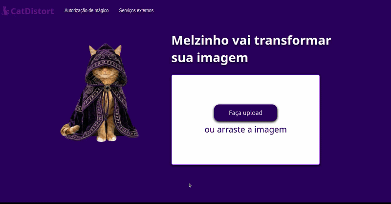

# CatDistort

O CatDistort é um app web destinado a entretenimento. O catdistort tem o intuito de criar memes partindo do conceito de piorar imagens, hoje muitos memes utilizam essa mecânica para deixar um meme já conhecido mais engraçado, além disso o catdistort também foi criado para interagir de forma ludica, partindo da ideia de que um gato mágico possui a mágia de piorar imagens.

interface: 

## Funcionalidades

- Upload de imagens
- Drag and drop (arrastar e soltar)
- Dowload de imagem editada
- Interface temática

## Estrutura do projeto

O projeto conta com uma estrutura bem simples. A estrutura do projeto é bem simples, [assets](assets) é a pasta aonde fica todas as mídias necessárias para o funcionamento correto do catdistort, [css](css) a pasta guarda toda parte do catdistort em CSS no arquivo [style.css](css/style.css), [js](js) a pasta guarda todas as funções do catdistort que são feitas em JavaScript dentro do arquivo [app.js](app.js), [index.html](index.html) o arquivo index é responsável pelo codigo fonte em HTML, possibilita com que possamos conectar tudo e construir nosso app web, e por ultimo o README.md que é responsável por explicar o projeto e suas funcionalidades, servindo de guia e apoio para a introdução ao projeto.

## Como executar o projeto

1. Abra o arquivo `index.html` diretamente no navegador ou clique duas vezes no arquivo.